# 韌體(更新/恢復)

:::tip 環境需求

本教學需要使用 **Python 3.12.10**，請先確認電腦已接上網際網路。

:::

## 前置準備

### 下載安裝 Python 3.12.10

- [Python 官網下載](https://www.python.org/downloads/release/python-31210/)

### 下載 exptech-device-recovery

#### 第 1 步：下載工具

請先到 GitHub 下載「exptech-device-recovery」。

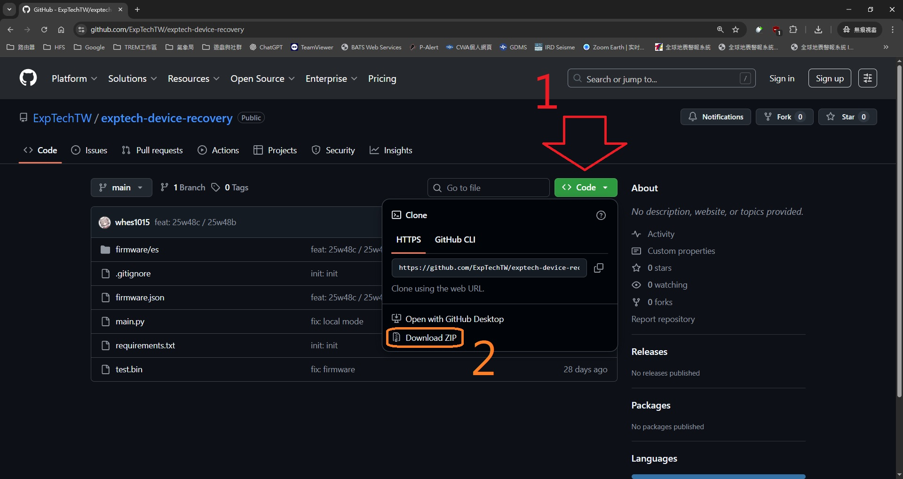

#### 第 2 步：解壓縮檔案

下載出來的是壓縮檔，把檔案解壓縮到任一位置。

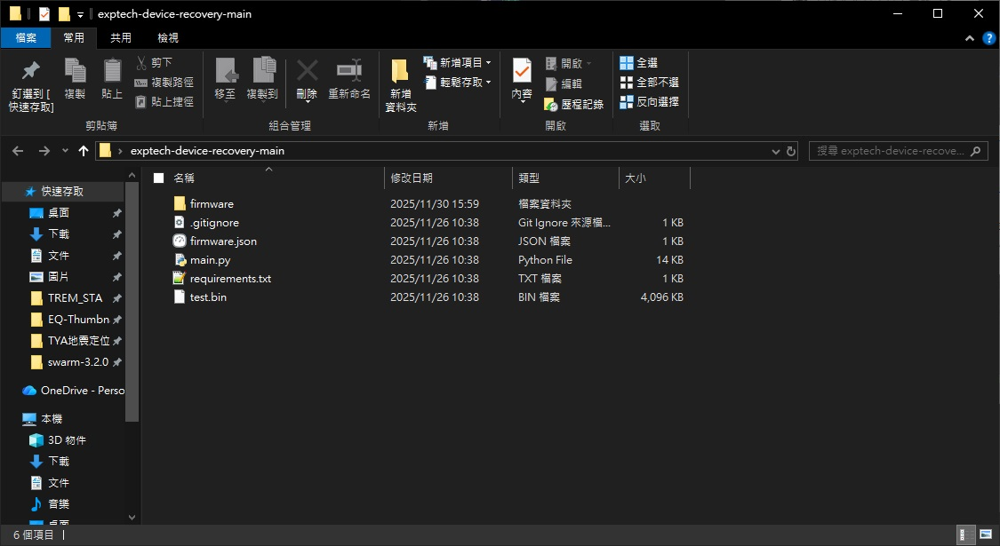

#### 第 3 步：開啟命令提示字元

在資料夾中輸入「cmd」，然後按下 Enter 鍵。

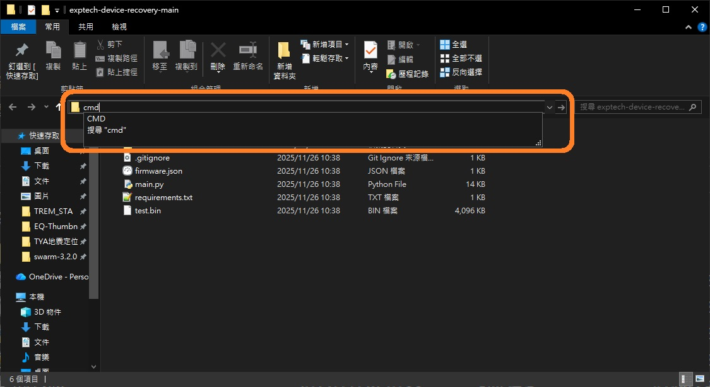

#### 第 4 步：安裝依賴套件

在 cmd 中輸入以下指令安裝所需的必要依賴：

```bash
pip install -r requirements.txt
```

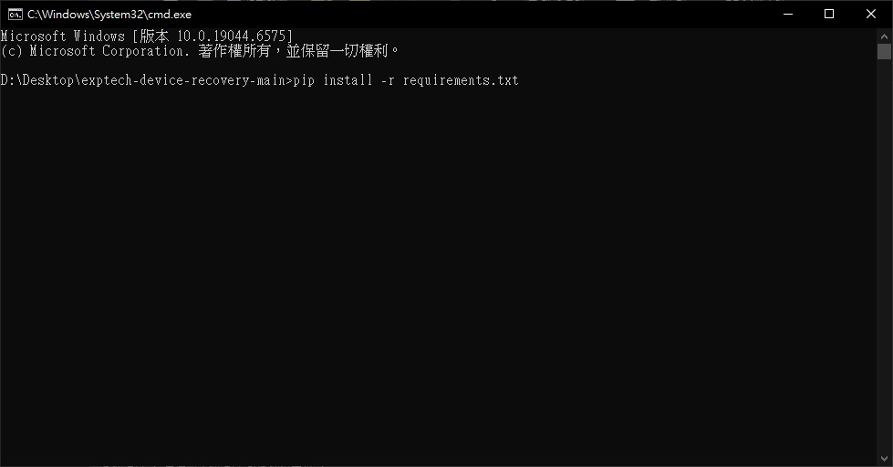

## 開始更新韌體

#### 第 5 步：執行主程式

在 cmd 中執行 main.py：

:::tip 重要提醒

- 請記得先把地震儀用 USB 接到電腦上再輸入以下指令
- 請確認驅動程式已安裝到電腦上

:::

```bash
python main.py
```

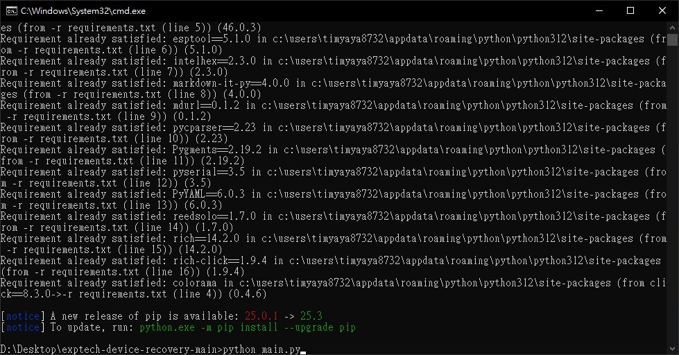

#### 第 6 步：選擇燒錄模式

請選擇「[1] 使用 firmware.json 中的韌體燒錄（預設）」，直接輸入 `1`，並按下 Enter 鍵。

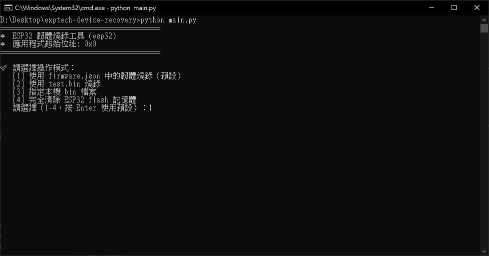

#### 第 7 步：選擇連接埠

請選擇對應的地震儀連接埠裝置。

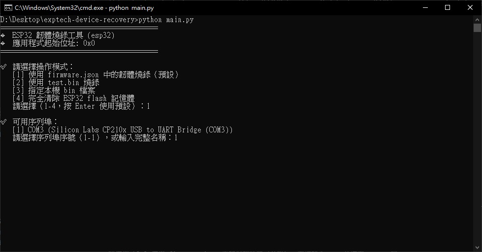

#### 第 8 步：選擇地震儀型號

接著工具會去搜尋遠端的資料庫檔案，搜尋完成後，請選擇對應的地震儀型號。

:::warning 重要

請根據您購買的地震儀型號燒入韌體，如果燒入錯誤請重新燒入正確的型號韌體。

:::

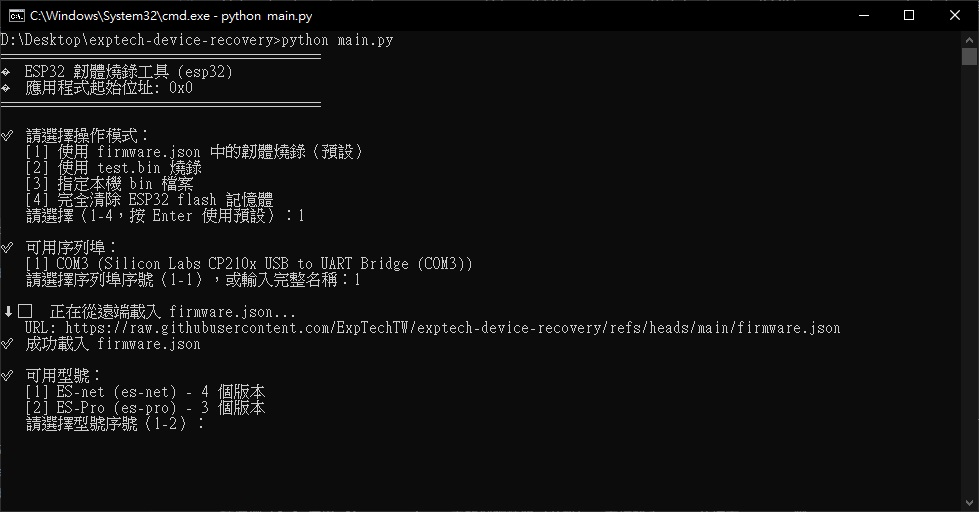

#### 第 9 步：選擇韌體版本

型號選擇完成後，請選擇最新韌體版本。

:::tip 版本識別

- 本教學示範使用「ES-Pro」
- 「(最新，預設)」顯示的地方錯誤，請注意識別
- 格式：**「年」w「週」「a、b、c...」**

:::

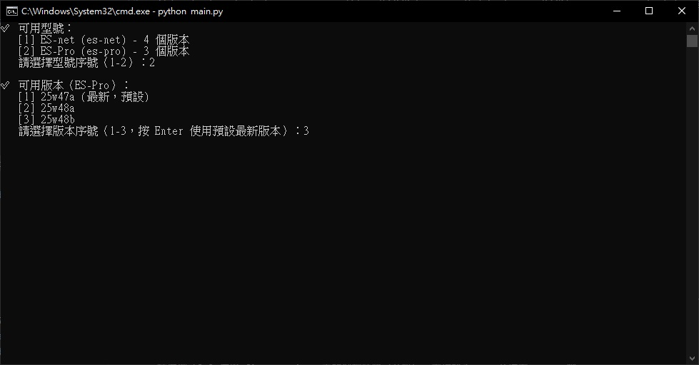

#### 第 10 步：完成燒錄

看到「🎉 燒錄完成！請重新啟動您的 ESP32 裝置。」後，地震儀會自動重啟。

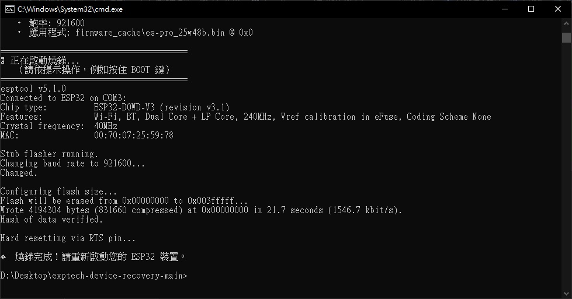

:::tip Pro 版本

如果是購買 Pro 的版本，在螢幕上會看到現在的韌體版本號。

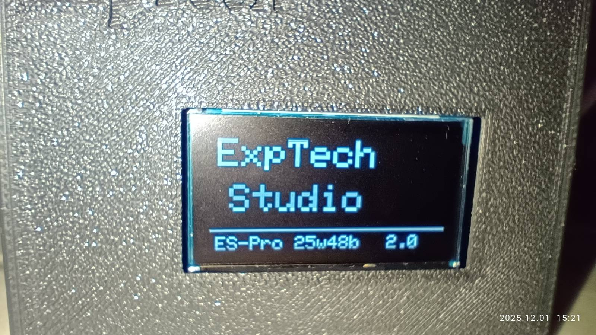

:::

#### 第 11 步：完成設定

地震儀重新開機完成後，請重新上傳無線網路資料到地震儀。
